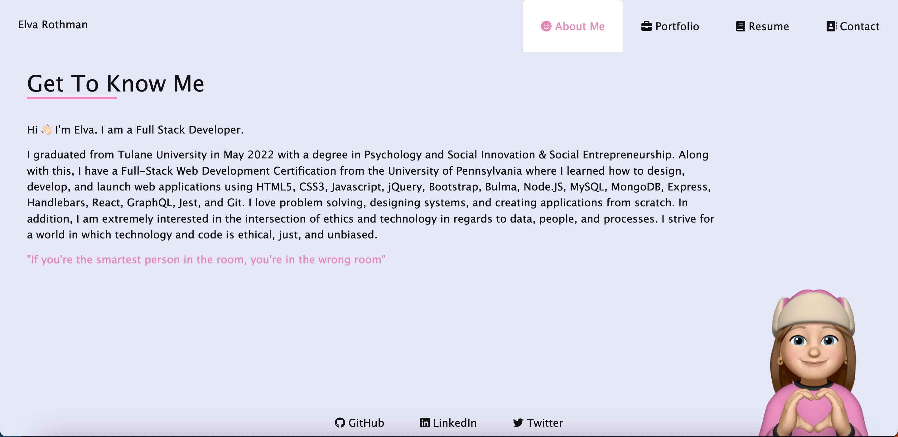

# Elva Rothman React Portfolio

## Description
Hi! My name is Elva Rothman and this is my portfolio that showcases my latest works as a Full Stack Developer. To create this portfolio, I have utilized React.js, Javascript, CSS, Bootstrap, and HTML. This application is a SPA, or a single page application. It has been designed to provide a seamless and interactive browsing experience for visitors. By employing React.js, I have leveraged its component-based architecture to build reusable UI elements, ensuring a modular and efficient development process.

JavaScript has been instrumental in enhancing the interactivity and functionality of this portfolio. Through its dynamic scripting capabilities, I have implemented various features such as smooth transitions, form validations, and interactive elements to engage users.

To ensure a visually appealing and responsive design, CSS and Bootstrap have been utilized. With CSS, I have customized the styling and layout of the portfolio, making it aesthetically pleasing and user-friendly. Bootstrap has provided a solid foundation for responsive design, allowing the portfolio to adapt seamlessly to different screen sizes and devices.

HTML forms the backbone of this portfolio, structuring the content and providing semantic markup. By adhering to best practices and utilizing HTML5 elements, I have optimized accessibility and search engine visibility.

The combination of these technologies has enabled me to create a robust and engaging single page application that effectively showcases my latest works as a Full Stack Developer. Through this portfolio, I aim to demonstrate my skills, creativity, and passion for developing innovative web applications.

## Usage
To browse my portfolio, [click here](https://erothman1.github.io/elva-rothman-react-portfolio/)!

## Contributions
Feel free to explore the different sections of my portfolio and learn more about the projects I have worked on. If you have any inquiries or would like to discuss potential collaborations, please don't hesitate to reach out. Thank you for visiting! You can reach me at elva.rothman.developer@gmail.com !